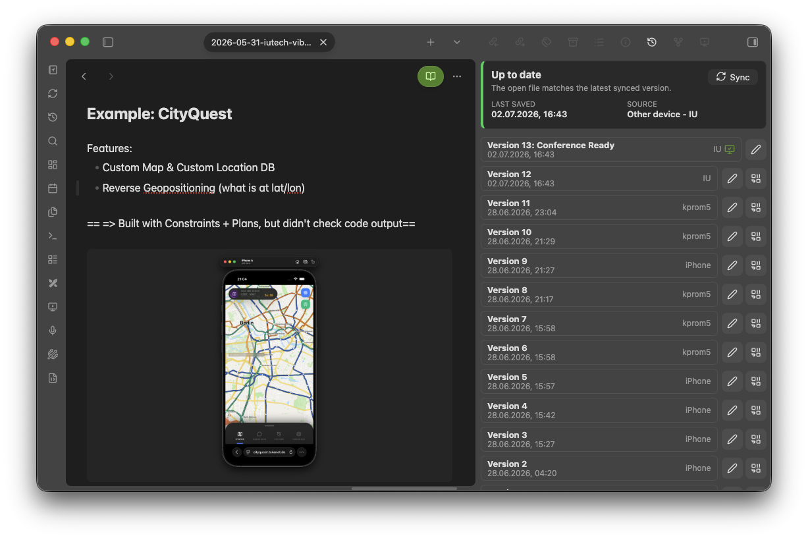

# ObsidiSync for Obsidian



This project contains:

- An Obsidian plugin that runs on iOS, iPadOS, and macOS.
- A Rust sync server that performs all native Git operations.

The device does not run Git. The plugin sends changed files to:

```text
/v1/users/{user}/vaults/{vault}
```

The Rust server validates the bearer token, authorizes the `{user}` namespace, commits Git history, optionally rebases and pushes to a configured remote, and returns merged file changes. Tokens can come from OIDC or from the built-in single-user password mode.

## Installation overview

ObsidiSync is not registered in the Obsidian community plugin registry yet. It will not appear in **Settings -> Community plugins -> Browse**. On iOS, install it from GitHub with BRAT, or use the manual file-copy fallback below.

The plugin also requires the ObsidiSync sync server. The iOS app does not run Git and cannot sync by itself; it sends vault changes to the server, and the server performs Git commits, rebases, pushes, conflict handling, and file history lookups. Build and deploy the Docker container before configuring the plugin on iOS.

### 1. Deploy the sync server

Build the container:

```bash
docker build -t obsidian-git-sync-server .
```

Run it with persistent storage:

```bash
docker run --rm \
  -p 8787:8787 \
  -v obsidian-git-sync-data:/data \
  -e OBSIDIAN_GIT_SYNC_PASSWORD_USER="alice" \
  -e OBSIDIAN_GIT_SYNC_PASSWORD_SETUP_TOKEN="replace-with-a-long-random-token" \
  -e OBSIDIAN_GIT_SYNC_ALLOWED_REMOTE_HOSTS="github.com,gitlab.com,git.example.com" \
  obsidian-git-sync-server
```

Expose the server over HTTPS for real iOS use, usually through a reverse proxy. In the plugin settings, the sync server URL must point to this deployed server.

Use OIDC instead of password mode by setting the OIDC environment variables shown in [Run the Rust server](#run-the-rust-server).

### 2. Install from GitHub on iOS with BRAT

BRAT is the recommended way to install ObsidiSync on iOS before it is accepted into the official Obsidian community plugin registry.

1. Open Obsidian on iOS.
2. Go to **Settings -> Community plugins -> Browse**.
3. Install **BRAT**.
4. Enable **BRAT**.
5. Open **BRAT** settings.
6. Choose **Add Beta plugin**.
7. Enter:

```text
https://github.com/kellertobias/obsidisync
```

or:

```text
kellertobias/obsidisync
```

BRAT installs the GitHub release assets into the vault plugin folder. The GitHub release must contain:

```text
main.js
manifest.json
plugin.zip
```

After BRAT installs ObsidiSync, enable **ObsidiSync** under:

```text
Settings -> Community plugins -> Installed plugins
```

Then configure the sync server URL and click **Log in** in the ObsidiSync settings.

### 3. Manual install fallback

If you are not using BRAT, build the plugin yourself:

```bash
npm install
npm run build:plugin
```

This produces:

```text
main.js
manifest.json
```

Create this folder inside the Obsidian vault:

```text
.obsidian/plugins/ios-git-sync/
```

Copy the built plugin files into it:

```text
.obsidian/plugins/ios-git-sync/main.js
.obsidian/plugins/ios-git-sync/manifest.json
```

The final layout should be:

```text
YourVault/
  .obsidian/
    plugins/
      ios-git-sync/
        main.js
        manifest.json
```

The easiest way on iOS is usually to place the files from macOS into an iCloud Drive vault, then let iCloud sync them to the device. You can also use another file sync method that preserves the `.obsidian/plugins/ios-git-sync/` path.

After the files are on the device, open Obsidian on iOS and enable **ObsidiSync** under:

```text
Settings -> Community plugins -> Installed plugins
```

Then configure the sync server URL and click **Log in** in the ObsidiSync settings.

## Storage model

- Text/code files are stored and versioned directly in Git.
- Binary files such as images/audio are stored as plain object files under the server vault directory.
- Binary metadata is committed to Git in `.obsidian-git-sync/binary-manifest.json`.
- Changed file contents are uploaded to the server in bounded chunks before sync; the final sync request references staged upload IDs instead of embedding large base64 payloads.
- If no Git remote URL is configured, the server keeps a normal local Git repository under the data directory and never fetches or pushes.
- This keeps Git useful for actual text/code version storage while avoiding binary blobs in Git history.

Server layout:

```text
data/users/{user}/vaults/{vault}/repo
data/users/{user}/vaults/{vault}/binary
data/users/{user}/vaults/{vault}/uploads
data/users/{user}/vaults/{vault}/state.json
```

## Build and test

```bash
npm install
npm run build
npm test
```

Plugin output:

```text
main.js
manifest.json
```

Rust server binary:

```text
rust-server/target/release/obsidian-git-sync-server
```

## Release checklist

The Forgejo repository releases automatically: every push to `main` runs `semantic-release` (see `.releaserc.json`), which inspects the commits since the last release using [Conventional Commits](https://www.conventionalcommits.org/) to decide the next version, updates `package.json`, `package-lock.json`, and `manifest.json` in the CI workspace, tags the triggering commit as `vX.Y.Z`, and publishes a Forgejo release with `main.js` and `manifest.json` as assets. No manual version bump or tag is needed for that repository.

To trigger a release, just merge Conventional Commit messages (`feat:`, `fix:`, etc.) into `main`. A commit type that doesn't map to a version bump (`chore:`, `docs:`, `refactor:`, ...) will not produce a release.

The GitHub mirror release workflow (`.github/workflows/plugin-ci.yml`) is unaffected by this and still publishes a GitHub release whenever a `vX.Y.Z` tag is pushed there. It derives the release manifest version from the tag and uploads `main.js`, `manifest.json`, and `plugin.zip`, so BRAT installs from GitHub keep working from tags pushed to that remote.

## Run the Rust server

Production OIDC mode:

```bash
export OIDC_ISSUER="https://issuer.example.com"
export OIDC_AUDIENCE="obsidian-git-sync"
export OIDC_DEVICE_CLIENT_ID="obsidian-device"
export OIDC_DEVICE_SCOPE="openid profile email"
export OIDC_USER_CLAIM="preferred_username"
export OIDC_JWKS_URL="https://issuer.example.com/keys" # optional; otherwise discovered from OIDC metadata
export ZITADEL_API_TOKEN="replace-with-zitadel-service-user-token" # optional; enables Zitadel active-user checks on refresh
export ZITADEL_BASE_URL="https://issuer.example.com" # optional; defaults to OIDC_ISSUER when ZITADEL_API_TOKEN is set
export OBSIDIAN_GIT_SYNC_DATA_DIR="/srv/obsidian-git-sync"
export OBSIDIAN_GIT_SYNC_LISTEN="127.0.0.1:8787"
export OBSIDIAN_GIT_SYNC_MAX_BODY_BYTES="52428800"
export OBSIDIAN_GIT_SYNC_ALLOWED_REMOTE_HOSTS="github.com,gitlab.com,git.example.com" # required for network remotes
export OBSIDIAN_GIT_SYNC_ALLOWED_ORIGINS="" # default: no browser CORS headers
npm run start:server
```

Single-user password mode without SSO:

```bash
export OBSIDIAN_GIT_SYNC_PASSWORD_USER="alice"
export OBSIDIAN_GIT_SYNC_PASSWORD_SETUP_TOKEN="replace-with-a-long-random-token"
export OBSIDIAN_GIT_SYNC_DATA_DIR="/srv/obsidian-git-sync"
export OBSIDIAN_GIT_SYNC_LISTEN="127.0.0.1:8787"
export OBSIDIAN_GIT_SYNC_ALLOWED_REMOTE_HOSTS="github.com,gitlab.com,git.example.com" # only needed when using network remotes
npm run start:server
```

Then click **Log in** in the Obsidian plugin settings. On the first login, the plugin asks for the setup token and sets the password through the server; later logins use the same button and store the returned access token automatically. If `OBSIDIAN_GIT_SYNC_PASSWORD_SETUP_TOKEN` is not set, the server generates a random setup token and logs it at startup. The web `/login` page remains available for browser access to the change feed and manual token recovery. `OBSIDIAN_GIT_SYNC_USER` is accepted as a shorter alias for `OBSIDIAN_GIT_SYNC_PASSWORD_USER`.

After logging in, the page also shows a recent change feed for the user's synced vaults.

Local development token mode:

```bash
export OBSIDIAN_GIT_SYNC_DEV_TOKEN="change-me"
export OBSIDIAN_GIT_SYNC_DEV_USER="alice"
export OBSIDIAN_GIT_SYNC_ALLOW_LOCAL_REMOTES="true" # only for local bare test repos
npm run start:server
```

Use HTTPS in production, usually by placing the server behind a reverse proxy.

Docker:

```bash
docker build -t obsidian-git-sync-server .
docker run --rm \
  -p 8787:8787 \
  -v obsidian-git-sync-data:/data \
  -e OIDC_ISSUER="https://issuer.example.com" \
  -e OIDC_AUDIENCE="obsidian-git-sync" \
  -e OIDC_DEVICE_CLIENT_ID="obsidian-device" \
  -e OIDC_USER_CLAIM="preferred_username" \
  -e OBSIDIAN_GIT_SYNC_ALLOWED_REMOTE_HOSTS="github.com,gitlab.com,git.example.com" \
  obsidian-git-sync-server
```

The container listens on `0.0.0.0:8787` and stores server state in `/data`.

Security defaults:

- OIDC issuer/JWKS URLs must use HTTPS, except localhost development URLs.
- Password mode stores the Argon2 password hash under `OBSIDIAN_GIT_SYNC_DATA_DIR/auth/password.json` and hashed server session tokens under `OBSIDIAN_GIT_SYNC_DATA_DIR/auth/sessions.json`.
- First-time password setup requires `OBSIDIAN_GIT_SYNC_PASSWORD_SETUP_TOKEN` or the generated setup token printed in server logs.
- Plugin server/OIDC URLs must use HTTPS, except localhost development URLs.
- Leaving the Git remote URL blank is allowed and selects server-local Git storage in `OBSIDIAN_GIT_SYNC_DATA_DIR`.
- Git remotes must use HTTPS or SSH. Local paths and `file://` remotes are disabled unless `OBSIDIAN_GIT_SYNC_ALLOW_LOCAL_REMOTES=true`.
- HTTPS remote URLs with embedded credentials are rejected so tokens are not written to `state.json`; configure server-side Git credentials or SSH keys instead.
- Network remote hosts are default-deny. List each allowed Git host in `OBSIDIAN_GIT_SYNC_ALLOWED_REMOTE_HOSTS` when using a remote URL.
- CORS headers are not emitted by default. Set `OBSIDIAN_GIT_SYNC_ALLOWED_ORIGINS` to exact origins if you intentionally call the API from a browser app.

## Plugin setup

Install:

```text
.obsidian/plugins/ios-git-sync/main.js
.obsidian/plugins/ios-git-sync/manifest.json
```

Configure:

- Sync server URL
- Click **Log in**. The plugin fetches public auth settings from the server and stores the access token automatically.
- Vault name, e.g. `personal`. This defaults to the Obsidian vault name.
- Author name/email
- Computer name, generated automatically on install and editable if needed.
- Sync on startup and sync interval

Advanced settings:

- Access token, only for static-token development servers or recovery.
- Refresh token, a server-issued single-use token used to renew the app session.
- User namespace, normally set automatically from the authenticated server user.

The plugin always registers vaults on the `main` branch and uses the persistent server-local repository at `data/users/{user}/vaults/{vault}/repo`.

The plugin checks `/v1/server/info` before authenticated server operations and records the server version/API version in settings. If the server reports an incompatible API version, the plugin stops before syncing and shows a compatibility error.

### First sync

The first time a vault syncs with the server, the plugin does not merge automatically. Instead it asks how to reconcile the local vault with whatever is already on the server:

- **Force push** uploads the local vault and overwrites the server so it matches this device. Anything that only exists on the server is removed. Because this destroys server data, the plugin asks for a second explicit confirmation before proceeding.
- **Overwrite local** replaces the local files with the server's copy. Before anything is deleted, the current local files are copied to a backup folder inside the vault. The plugin proposes a default backup folder under `.obsidian-git-sync/backups/` (which is never synced); the path can be changed, or the field cleared to skip the backup.

After either choice completes, normal merge-based syncing takes over. Use **Reset registration** in the advanced settings to forget the sync state and have the plugin ask again on the next sync.

### Sync status and recovery

The settings page shows:

- Current sync status: idle, running, queued, or error.
- Last sync attempt.
- Last successful sync.
- Last sync error.
- Server version and API version after the last compatibility check.

Use the **Check** button in the Server setting to verify server compatibility and the current authenticated session without starting a sync.

If a sync is requested while another sync is running, ObsidiSync queues one follow-up sync and runs it immediately after the current sync finishes. If the server returns `401` or `403`, ObsidiSync attempts one server session refresh when a refresh token is available. If refresh fails or no refresh token exists, log in again from ObsidiSync settings.

### Login flow

The plugin only needs the sync server URL to start login:

1. The plugin calls `GET /v1/auth/config`.
2. In password mode, the plugin shows a username/password form and calls `/v1/auth/password/login` or `/v1/auth/password/setup`. First-time setup also requires the setup token.
3. In OIDC mode, the server returns the public device-flow client configuration, and the plugin performs device login with the issuer advertised by the server.
4. The plugin sends the OIDC access token to `POST /v1/auth/oidc/login` and stores only the server-issued access token and refresh token.
5. The plugin calls `GET /v1/auth/session` to set the user namespace.

OIDC provider details are server configuration, not client setup. In OIDC mode the server requires:

- `OIDC_ISSUER`: issuer base URL.
- `OIDC_AUDIENCE`: audience expected in access tokens.
- `OIDC_DEVICE_CLIENT_ID`: public OIDC client configured for device authorization.
- `OIDC_DEVICE_SCOPE`: optional, defaults to `openid profile email`.
- `OIDC_USER_CLAIM`: optional, defaults to `preferred_username`.
- `ZITADEL_API_TOKEN`: optional service-user token used by the server to verify the OIDC subject is still active during app-session refresh for Zitadel deployments.
- `ZITADEL_BASE_URL`: optional Zitadel API base URL, defaults to `OIDC_ISSUER` when `ZITADEL_API_TOKEN` is set.

## Version UI

The plugin adds:

- **Show current file versions**
- **Resolve current conflict file**
- **Sync now**
- **Log in to ObsidiSync**

The version modal lists commits for the active file, previews selected versions read-only, copies text versions, and can replace the current file with a selected version.

## Conflict handling

The server uses:

- `git rebase origin/{branch}` for remote integration when a remote URL is configured, preserving flat history.
- `git merge-file` for server/client text conflicts before committing.

If a conflict remains, the plugin receives conflict-marker content and writes it into the file. This works on mobile because the user resolves the file inside Obsidian, then runs **Resolve current conflict file** or syncs again.

The sidebar file-history view shows a **Resolve** action next to **Sync** when the current file contains conflict markers. Closing the resolver refreshes open ObsidiSync history views and the mobile sync indicator.

## Backup and restore

Back up the complete server data directory configured by `OBSIDIAN_GIT_SYNC_DATA_DIR`. A consistent backup must include:

- `data/users/{user}/vaults/{vault}/repo`
- `data/users/{user}/vaults/{vault}/binary`
- `data/users/{user}/vaults/{vault}/state.json`
- `auth/password.json` when using password mode

Recommended procedure:

1. Stop the server or take a filesystem snapshot.
2. Copy the full data directory.
3. Restart the server.
4. Verify `/health` and `/v1/server/info`.

Restore procedure:

1. Stop the server.
2. Restore the full data directory to the configured `OBSIDIAN_GIT_SYNC_DATA_DIR`.
3. Start the server.
4. Open ObsidiSync settings, verify the server version is shown, then run a manual sync from one client.

Do not restore only the Git repository without the binary object store. Binary file version retrieval depends on the `binary` directory retaining objects referenced by Git metadata.

## Server maintenance

- Rotate password-mode tokens by stopping the server and deleting `auth/password.json`; then complete password setup again.
- Server-issued access tokens last 24 hours. Server-issued refresh tokens last 180 days, are rotated on every refresh, and can only be used once.
- For OIDC, SSO is used for the initial login exchange. Clients refresh expired app sessions through the sync server; otherwise they should log in again when the plugin reports an expired or unauthorized login.
- Keep `uploads/` on persistent storage while syncs are active. Stale upload directories can be removed only when no clients are syncing.
- Keep the `binary/` object store with the Git repo. Pruning binary objects without checking Git metadata can break historical binary versions.
- Monitor server logs for `request failed`, Git rebase failures, and upload verification failures.

## API

- `GET /v1/auth/config`
- `GET /v1/auth/session`
- `POST /v1/auth/session/refresh`
- `POST /v1/auth/oidc/login`
- `POST /v1/auth/password/setup`
- `POST /v1/auth/password/login`
- `POST /v1/users/{user}/vaults/{vault}/register`
- `POST /v1/users/{user}/vaults/{vault}/uploads`
- `POST /v1/users/{user}/vaults/{vault}/uploads/{upload}/chunk`
- `POST /v1/users/{user}/vaults/{vault}/uploads/{upload}/complete`
- `POST /v1/users/{user}/vaults/{vault}/sync`
- `GET /v1/users/{user}/feed`
- `GET /v1/users/{user}/vaults/{vault}/history?path=Note.md`
- `GET /v1/users/{user}/vaults/{vault}/file?path=Note.md&hash=<commit>`
- `POST /v1/users/{user}/vaults/{vault}/resolve`

## Limits

- The server sees plaintext vault contents.
- End-to-end encrypted content is out of scope for v1 because it prevents server-side text merges.
- OIDC device login is implemented. The provider token is exchanged for server-issued session tokens and is not used as the API bearer token.
- Binary file version retrieval depends on the server object store retaining the hash referenced by Git metadata.
- The plugin stores server-issued access and refresh tokens in Obsidian plugin data. Password mode tokens can be rotated by deleting `auth/sessions.json` or resetting the password data directory.
